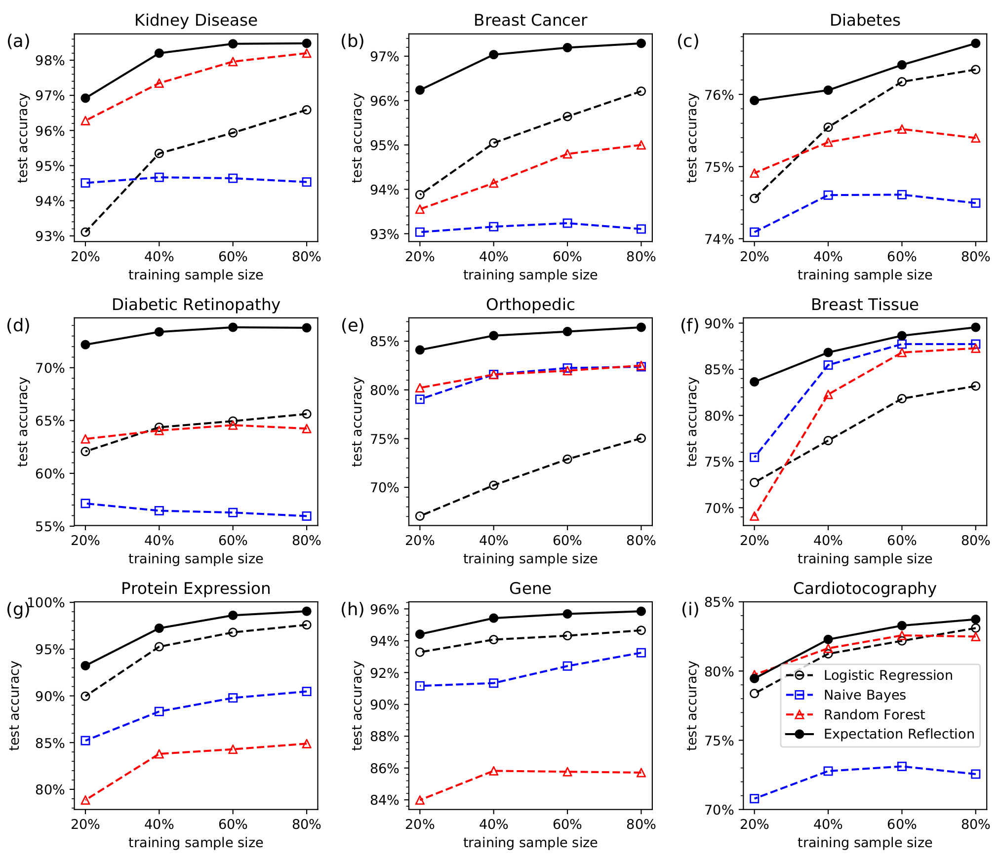

Expectation Reflection for Data Classification
======================================================

This work was designed to apply our Expectation Reflection method for data classification. We compare the performance of our approach with the state-of-the-art methods such as Logistic Regression, Naive Bayes, and Random Forest.

Table of Contents
-----------------------
Method

`Kidney Disease <https://github.com/danhtaihoang/expectation-reflection/blob/master/kidney.ipynb>`_

`Breast Cancer <https://github.com/danhtaihoang/expectation-reflection/blob/master/breastcancer.ipynb>`_

`Diabetes <https://github.com/danhtaihoang/expectation-reflection/blob/master/diabetes.ipynb>`_

`Diabetic Retinopathy <https://github.com/danhtaihoang/expectation-reflection/blob/master/diabetic_retinopathy.ipynb>`_

`Orthopedic <https://github.com/danhtaihoang/expectation-reflection/blob/master/orthopedic.ipynb>`_

`Breast Tissue <https://github.com/danhtaihoang/expectation-reflection/blob/master/breast_tissue.ipynb>`_

`Protein Expression <https://github.com/danhtaihoang/expectation-reflection/blob/master/protein.ipynb>`_

`Gene Sequence <https://github.com/danhtaihoang/expectation-reflection/blob/master/gene.ipynb>`_

`Cardiotocography <https://github.com/danhtaihoang/expectation-reflection/blob/master/cardiotocography.ipynb>`_

